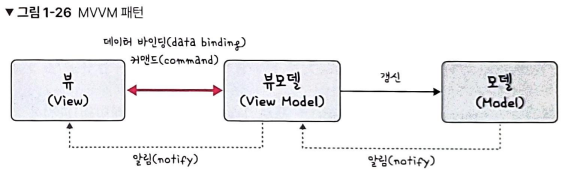
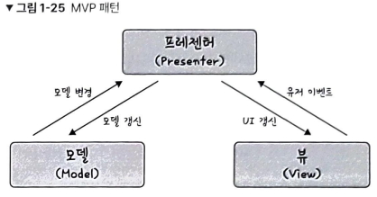

- 면접을 위한 CS전공지식 노트(스터디) 2022.10.16

### 🌞 프록시 패턴

- 대상 객체에 접근하기 전 접근에 대한 흐름을 가로채 대상 객체 앞단의 인터페이스 역할을 하는 디자인 패턴 → 객체의 속성, 변환 등을 보완하며 보안, 데이터 검증, 캐싱, 로깅
- 프록시 서버에서의 캐싱 → 캐시 안에 정보를 담아두고, 캐시 안에 있는 정보를 요구하는 요청에 대해 원격 서버에 요청하지 않고캐시 안에 있는 데이터를 활용. 불필요한 외부 서버의 연결을 줄이고 트래픽을 줄임.
    -  **프록시 서버** : 서버와 클라이언트 사이에서 클라이언트가 자신을 통해 다른 네트워크 서비스에 간접적으로 접속할 수 있게 해주는 컴퓨터 시스템이나 응용 프로그램
    - **서버와 클라이언트 사이에 중계기로서 대리로 통신을 수행하는 것을 가리켜 '프록시'**, 그 중계 기능을 하는 것을 프록시 서버라고 부른다
- 프록시 서버 대표 : nginx. (node.js의 버퍼 오버플로우 취약점을 예방하기 위해 사용) 익명 사용자의 직접적인 서버로의 접근을 차단하고 간접적으로 한 단계를 더 거침으로써 **보안성**을 더욱 강화.
    - 실제 포트를 숨기고, 정적 자원을 gzip 압축 or 메인 서버 앞단에서 로깅

### 🌞 이터레이터(Iterator) 패턴

이터레이터를 사용하여 컬렉션의 요소들에 접근하는 디자인 패턴. 자료형의 구조와 상관없이 이터레이터 인터페이스로 순회 가능.

- 이터레이터 프로토콜 : 이터러블한 객체들을 순회할 때 쓰이는 규칙
- 이터러블한 객체 : 반복 가능한 객체로 배열을 일반화한 객체

### 🌞 ****노출모듈 패턴****

즉시 실행 함수를 통해 private, public 같은 접근 제어자를 만드는 패턴.

- public - 클래스에 정의된 함수에서 접근 가능, 자식 클래스와 외부 클래스에서 접근 가능
- protected - 클래스에 정의된 함수에서 접근 가능, 자식 클래스 접근 가능, 외부 클래스 접근 불가능
- private - 클래스에 정의된 함수에서 접근 가능, 자식 클래스와 외부 클래스 접근 불가능
- 즉시 실행 함수 - 함수를 정의하자마자 바로 호출하는 함수, 초기화 코드, 라이브러리 내 전역 변수의 충돌 방지 등

### 🌞 MVC 패턴

애플리케이션의 구성 요소를 세 가지 역할로 구분하여 개발 프로세스에서 각각의 구성 요소에만 집중해서 개발 가능. 재사용성과 확장성이 용이함. 애플리케이션이 복잡해질수록 모델과 뷰의 관계가 복잡해지는 단점.

- **모델** - 애플리케이션의 데이터인 데이터베이스, 상수, 변수. 뷰에서 데이터를 생성하거나 수정하면 컨트롤러를 통해 모델을 생성하거나 갱신.
- **뷰** - 사용자 인터페이스 요소. 모델을 기반으로 사용자가 볼 수 있는 화면. 모델이 가지고 있는 정보를 따로 저장하지 않아야 하며 화면에 표시되는 정보만 가지고 있어야 함. 변경이 일어나면 컨트롤러에 전달.
- **컨트롤러** - 하나 이상의 모델과 하나 이상의 뷰를 잇는 다리 역할을 하며 이벤트 등 메인 로직 담당. 모델과 뷰의 생명주기 관리, 모델이나 뷰의 변경 통지를 받으면 이를 해석하여 각각의 구성 요소에 해당 내용에 대해 알림.

### 🌞 MVVM 패턴

뷰모델(ViewModel) = 뷰를 더 추상화한 패턴. MVC 패턴과 다르게 **커맨드**와 **데이터 바인딩**을 가지는 것이 특징. 뷰와 뷰 모델 사이의 양방향 데이터 바인딩을 지원하며  UI를 별도 코드 수정없이 재사용할 수 있고, 단위 테스팅이 용이함.

- 커맨드 : 여러 요소에 대한 처리를 하ㅏ의 액션으로 처리할 수 있게 하는 기법
- 데이터 바인딩 : 화면에 보이는 데이터와 웹 브라우저의 메모리 데이터를 일치시키는 기법. 뷰모델을 변경하면 뷰가 변경됨.

### 🌞 MVP 패턴

컨트롤러가 프레젠터(presenter)로 교체된 패턴으로 뷰와 프레젠터는 일대일 관계로, MVC 패턴보다 더 강한 결합을 지닌 디자인 패턴.

