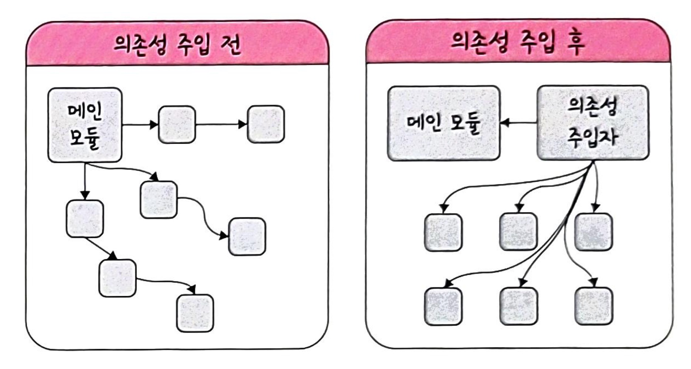

### 🌞 라이브러리 vs 프레임워크

라이브러리와 프레임워크는 **공통으로 사용될 수 있는 특정 기능을 모듈화**한 것으로, 둘의 차이는 **제어의 흐름**의 어디에 있는가의 차이.

- **라이브러리**
    - 프레임워크보다 자유롭고, 개발자가 직접 제어하고 필요한 상황에 가져다 씀.
- **프레임워크**
    - 라이브러리에 비해 엄격하고, 규칙이 있음→ 개발자가 프레임워크에 맞춰 개발.
    - 기능 구현에 집중하여 개발 가능 → 일정한 형태와 필요한 기능을 갖추고 있는 뼈대.
    - 제어의 흐름이 프레임워크에 있음. → **제어의 역전(IoC)**

### 🌞 상속(extends) vs 구현 (implements)

- **상속** (클래스, abstarct 클래스 기반)
    - 부모 클래스의 메소드 등을 상속받아 사용하며 자식클래스에서 추가 및 확장. 재사용성, 중복성 최소화
- **구현** (인터페이스 기반)
    - 부모 인터페이스를 자식 클래스에서 재정의하여 구현. 반드시 부모 인터페이스의 메소드를 재정의해서 구현해야 함.

---

# 📌 디자인 패턴

- 객체 간의 상호 관계 등을 이용해 해결할 수 있도록 하나의 '규약' 형태

### 🌞 싱글톤 패턴

- 싱글톤 패턴을 지양해야하는 이유 : 동시성 문제 → 쓰레드가 동시에 도착하여 각 쓰레드들이 null 객체를 바라보면서 쓰레드마다 객체를 생성.
    - 동시성을 해결하기 위한 방법
        - singleton instance 생성과 동시에 초기화
        - static synchronized 를 사용하여 하나의 쓰레드만 접근할 수 있도록 함. → 성능 이슈 발생
- 하나의 클래스에 오직 하나의 인스턴스만을 가지며, 이 인스턴스를 다른 모듈들이 공유하며 사용. 인스턴스 생성 비용 절감, 의존성이 높음.
- TDD에 적합하지 않음. -> 테스트마다 독립적인 인스턴스를 만들기 어렵기 때문
- 하나의 인스턴스를 여러 모듈에서 사용하기때문에 각 모듈간 결합도가 높기 때문에 의존성(DI)을 주입하여 모듈간 결합도를 낮춤.
→ A가 B에 의존성이 있다 = B가 변경되면 A도 변경되어야 함.
- 의존성 주입(DI) : 메인 모듈과 하위 모듈 사이에 의존성 주입자를 삽입하여 메인 모듈이 '간접적'으로 의존성을 주입하도록 함. → 의존성이 떨어짐
    - 장점 : 테스팅과 마이그레이션 용이, 애플리케이션 의존성 방향 일관, 애플리케이션 추론이 쉽고 모듈 간의 관계들이 조금 더 명확해짐. 재사용성 증가.
    - 단점 : 모듈이 분리되어 클래스 수가 늘어나 복잡성이 증가, 런타임 패널티가 생김.
- 정적 메소드(static) : 인스턴스 없이 호출 가능하여 메모리 절약, 개별 인스턴스에 묶이지 않아 클래스 내 함수를 정의할 수 있는 장점. static : 같은 곳의 메모리 주소만 바라보기 때문에 static 변수의 값 공유.

### 🌞 팩토리 패턴

- 객체를 사용하는 코드에서 객체 생성 부분을 떼어 내 추상화한 패턴.
- 상속 관계에 있는 두 클래스에서 상위 클래스가 중요한 뼈대를 결정, 하위 클래스에서 객체 생성에 관한 구체적인 내용을 결정하는 패턴.
- 상위 클래스와 하위 클래스가 분리되어 느슨한 결합을 가지고, 인스턴스 방식에 대해 전혀 알 필요가 없기 때문에 유연성을 가짐.
- 객체 생성 로직이 별도로 있기 때문에 코드 리팩토링을 할 때 한 곳만 고치면 되기때문에 유지보수성이 좋음.

### 🌞 전략 패턴(정책 패턴)

- 객체의 행위를 바꾸고싶을 때 '직접' 수정하지 않고 전략이라고 부르는 '캡슐화한 알고리즘'을 컨텍스트 안에서 바꿔주면서 상호 교체가 가능하게 만드는 패턴.

ex) 물건을 살 때 네이버 페이, 카카오페이 등 다양한 방식으로 '전략'만 바꿔 구매하는 것과 같음.

### 🌞 옵저버 패턴

- 주체(관찰자)가 객체의 상태변화를 관찰하다가 객체의 상태 변화가 있을 때마다 옵저버 목록에 있는 옵저버(객체가 바뀌면 같이 바뀌어야하는 것들)들에게 변화를 알림.

**ReferenceLink**

- [디자인 패턴](https://www.hanbit.co.kr/channel/category/category_view.html?cms_code=CMS8616098823)
- [싱글턴 패턴](https://cjw-awdsd.tistory.com/42)
- [static 과 싱글턴 패턴](https://wikidocs.net/228)