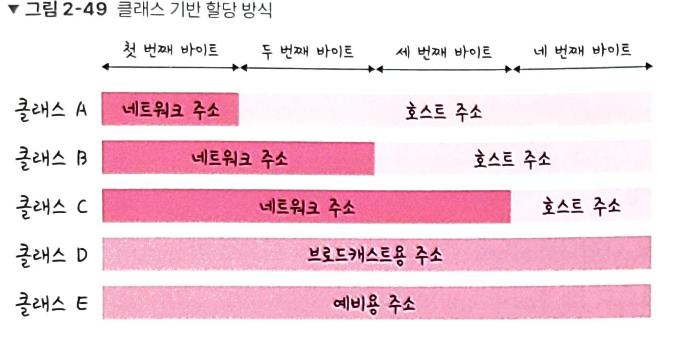
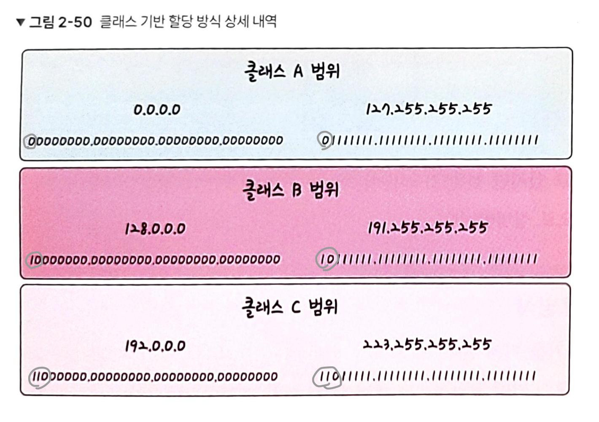
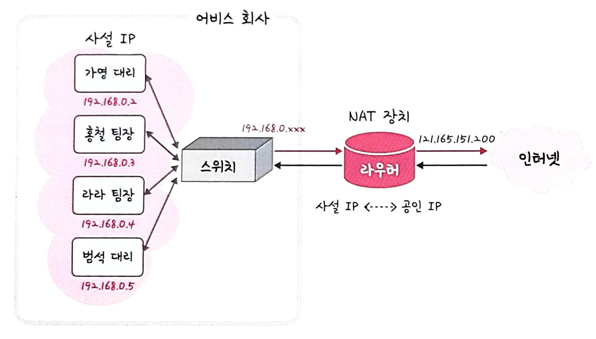
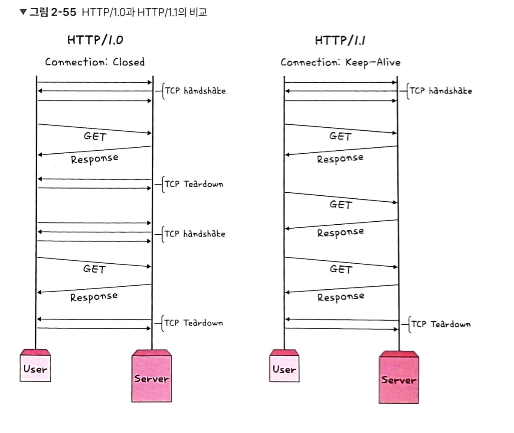
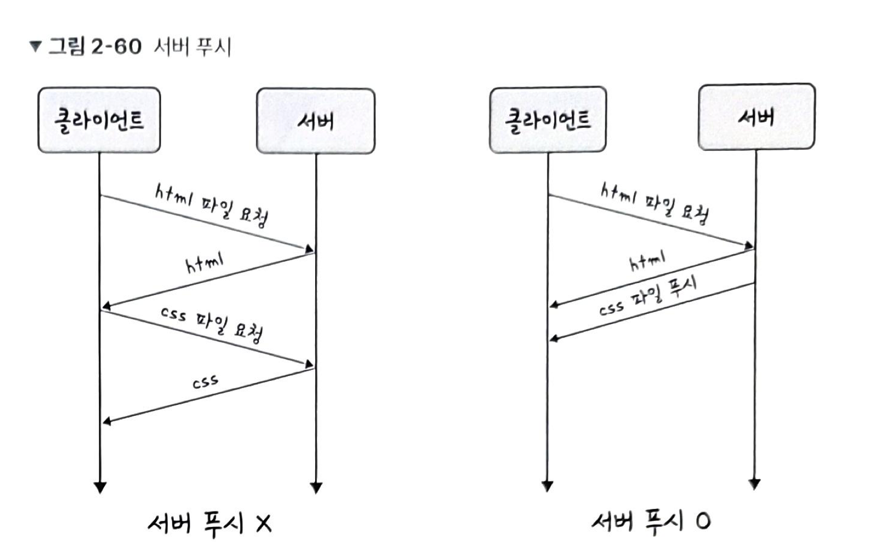
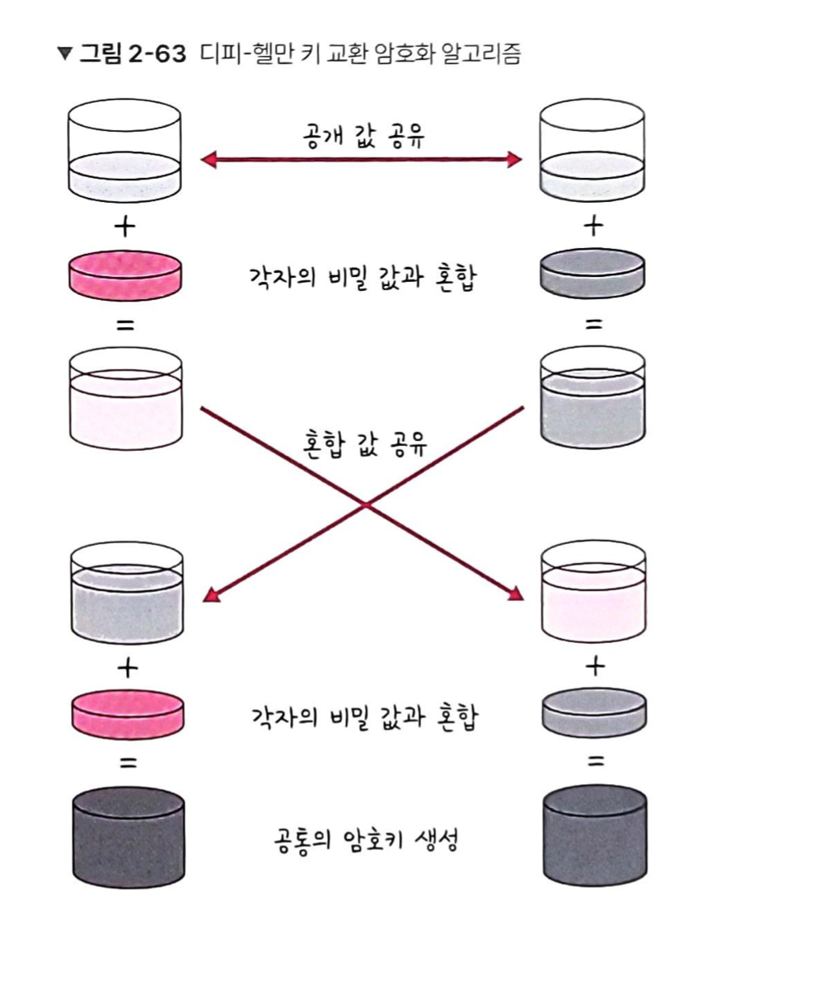
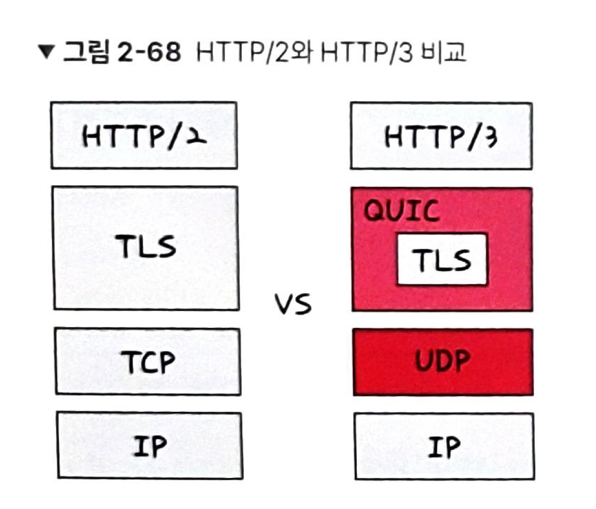
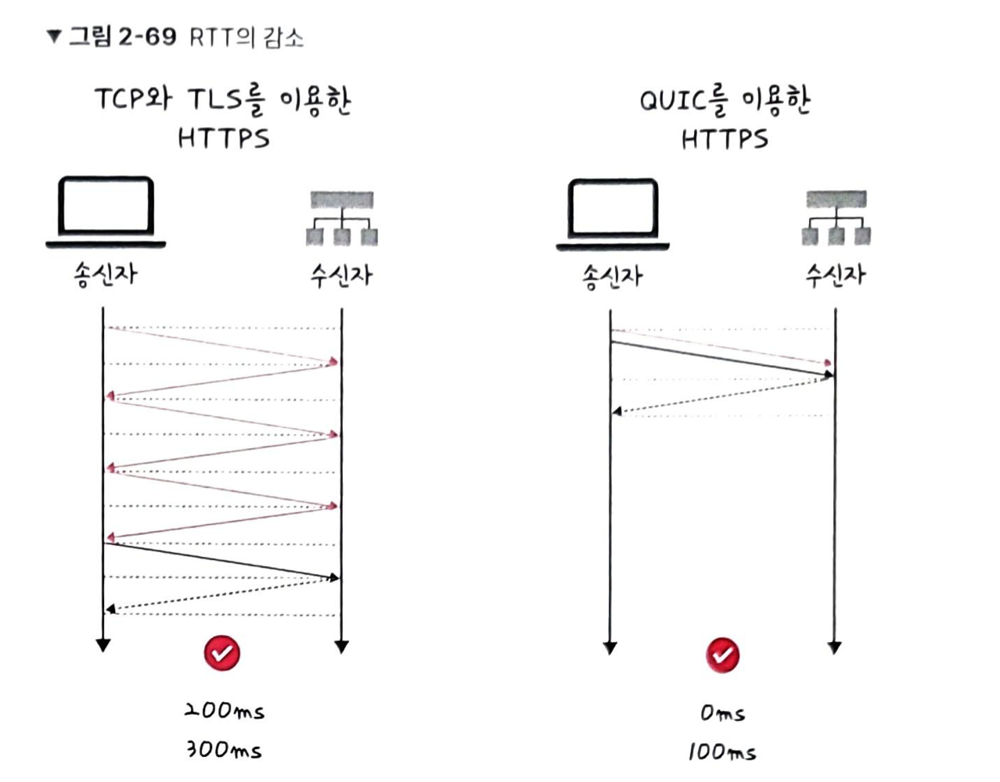

- 면접을 위한 CS 전공 지식 - 22.12.10

## 🌞 네트워크 기기

- 상위 계층을 처리할 수 있는 기기는 하위 계층을 처리할 수 있지만 반대는 불가. ex) L7 스위치는 애플리케이션 계층을 처리하는 기기로, 그 밑의 모든 계층의 프로토콜 처리 가능.
    - 애플리케이션 계층 : L7 스위치
        - 스위치는 여러 장비를 연결하고 데이터 통신 중재. **목적지가 연결된 포트로만 전기 신호를 보내 데이터를 전송**하는 통신 네트워크 장비.
        - **로드 밸런서**. **서버 부하 분산**. 클라이언트로부터 오는 요청들을 뒤쪽의 여러 서버로 나누는 역할. 시스템이 처리할 수 있는 트래픽 증가를 목표.
            - URL, 서버, 캐시, 쿠키 기반으로 트래픽 분산. 바이러스, 불필요한 외부 데이터 등 필터링. 응용 프로그램 수준의 트래픽 모니터링.
            - 장애가 발생한 서버가 있다면 정기적인 **헬스 체크**를 이용하여 감시하며 트래픽 분산 대상에서 제외.
                - 헬스 체크 - 전송 주기와 재전송 횟수 등 설정 후 반복적으로 서버에 요청을 보냄.
                - 서버에 부하 되지 않을 만큼 적절한 요청 횟수, TCP-HTTP 등 다양한 방법으료 어청을 보냄. ex) TCP요청을 보냈는데 3-way handshake 정상적으로 발생하지 않았다면 서버는 비정상.
            - 로드밸런서의 대표적인 기능 서버 이중화. 에러가 발생하여 서버 1대가 종료되어도 서비스의 안정적인 운용 필요.
            - 로드 밸런서는 L7 스위치뿐만 아니라 L4 스위치도 있음. **L4 스위치**는 인터넷 계층을 처리하는 기기로 스트리밍 관련 서비스에서 사용 불가, 메시지 기반으로 인식하지 못하고 IP와 포트 기반(특히 포트) 트래픽 분산. ↔ **L7 로드밸런서**는 IP, 포트 외에도 URL, HTTP 헤더, 쿠키 등 기반으로 트래픽 분산. (AWS - L4- Netwrok Load Balancer, L7 - Application Load Balancer)
            
    - 인터넷 계층 : 라우터, L3 스위치
        - 라우터 : 여러 개의 네트워크 연결,분할,구분. 다른 네트워크에 존재하는 장치끼리 서로 데이터를 주고 받을 때 **최소한의 패킷 소모, 최적화 경로로 최소 경로로 패킷 포워딩**.
        - L3 스위치 : L2 스위치의 기능과 라우팅 기능을 갖춘 장비. == 라우터.
            - 라우터 - 1) 소프트웨어 기반 라우팅 2) 하드웨어 기반 라우팅. L3 스위치는 하드웨어 기반 라우팅 담당.
        
        | 구분 | L2 스위치 | L3 스위치 |
        | --- | --- | --- |
        | 참조 테이블 | MAC 주소 테이블 | 라우팅 테이블 |
        | 참조 PDU | 이더넷 프레임 | IP 패킷 |
        | 참조 주소 | MAC 주소 | IP 주소 |
    - 데이터 링크 계층 : L2스위치, 브리지
        - L2 스위치 : 장치들의 MAC 주소를 MAC 주소 테이블을 통해 관리. 연결된 장치로부터 패킷이 왔을 때 패킷 전송 담당. **IP 주소를 이해하지 못하기 때문에 IP 주소 기반 라우팅 불가**. 패킷의 MAC 주소를 읽어 스위칭. 목적지가 MAC 주소 테이블에 없다면 전체 포트에 전달하고 MAC 주소 테이블의 주소는 일정 시간 이후 삭제하는 기능도 있음.
        - 브리지 : 두개의 근거리 통신망(LAN)을 상호 접속할 수 있도록 하는 통신망 연결 장치. 포트와 포트 사이의 다리 역할. 장치에서 받아온 MAC 주소를 MAC 주소 테이블로 관리. 통신망 범위를 확장하고 서로 다른 LAN 등으로 이루어진 ‘하나의’ 통신망 구축할 때 쓰임.
        
    - 물리 계층 : NIC, 리피터, AP
        - NIC : LAN 카드라고 하는 네트워크 인터페이스 카드(NIC)는 2대 이상의 컴퓨터 네트워크를 구성하는데 사용. 네트워크와 빠른 속도로 데이터를 송수신할 수 있도록 컴퓨터 내에 설치하는 확장 카드. 각 LAN 카드에는 고유 식별 번호 MAC주소가 있음.
        - 리피터 : 들어오는 약해진 신호 정도를 증폭하여 다른 쪽으로 전달하는 장치로 패킷이 더 멀리 갈 수 있음. → 광케이블 보급으로 잘 쓰이지 않음.
        - AP : 패킷을 복사하는 기기.  유선 LAN 연결한 후, 다른 장치에서 무선 LAN 기술을 사용하여 무선 네트워크에 연결.
    

## 🌞 IP 주소 (인터넷 계층)

- 논리적 주소 - IP , 물리적 주소 - MAC
- ARP (Address Resolution Protocol)
    - IP 주소로부터 mac 주소를 구하는 IP와 MAC 주소의 다리 역할을 하는 포로토콜.
    - 가상 주소인 IP 주소를 실제 주소인 MAC주소로 변환.
- RARP
    - ARP와 반대로, 실제 주소인 MAC 주소를 가상 주소인 IP 주소로 변환.

ex) 장치 A가 ARP request 브로드캐스트를 보내서 ip 주소 120.70.80.3에 해당하는 MAC 주소를 찾고, 해당 주소에 맞는 장치 B가 ARP reply 유니캐스트를 통해 MAC 주소를 반환하는 과정을 거쳐 IP 주소에 맞는 MAC주소를 찾음.

- 홉바이홉 통신 (hop by hop) : IP 주소를 통해 통신하는 과정.
    - 각각의 라우터에 있는 라우팅 테이블의 IP를 기반으로 패킷을 전달하고 다시 전달.
    - 통신 장치에 있는 라우팅 테이블의 IP를 통해 시작 주소부터 시작하여 다음 IP로 계속해서 이동하는 라우팅 과정을 거쳐 패킷이 최종 목적지까지 도달하는 통신.
- 라우팅 테이블
    - 송신지에서 수신지까지 도달하기 위해 사용되며, 라우터에 들어가 있는 목적지 정보들과 그 목적지로 가기위한 방법이 들어있는 리스트. 게이트웨이와 모든 목적지에 대해 해당 목적지에 도달하기 위해 거쳐야할 다음 라우터의 정보를 가지고 있음.
- 게이트 웨이
    - 서로 다른 통신망, 프로토콜을 사용하는 네트워크 간의 통신을 가능하게 하는 관문 역할을 하는 컴퓨터나 소프트웨어. 서로 다른 네트워크상의 통신 프로토콜을 변환해주는 역할.
    - 라우팅 테이블을 통해 게이트 웨이 확인 가능.

## 🌞 IP 주소 체계

- IPv4 - 32비트를 8비트 단위로 점을 찍어 표기.
- IPv6 - 64비트를 16비트 단위로 점을 찍어 표기.
- **클래스 기반 할당 방식 (CIDR)**
    - A,B,C,D,E 다섯개의 클래스로 구분. 앞에 있는 부분을 네트워크 주소, 그 뒤에 있는 부분을 컴퓨터에 부여하는 주소인 호스트 주소로 놓아서 사용.
    - A,B,C : 일대일 통신, D : 멀티캐스트 통신, E : 앞으로 사용할 예비용.
    - 맨 왼쪽에 있는 비트를 구분 비트라고 함.
    - 클래스 A 구분 비트 - 0, 클래스 B - 10, 클래스 C - 110.
    - 네트워크의 첫 번째 주소는 네트워크 주소, 가장 마지막 주소는 브로드 캐스트용 주소로 네트워크에 속해 있는 모든 컴퓨터에 데이터를 보낼 때 사용.
    - 사용하는 주소보다 버리는 주소가 많은 단점으로 이를 해소하기 위해 DHCP, IPv6, NAT.

- **DHCP** (Dynamic Host Configuration Protocol)
    - IP 주소 및 기타 통신 매개변수를 자동으로 할당하기 위한 네트워크 관리 프로토콜.
    - 네트워크 장치의 IP 주소를 수동으로 설정할 필요 없이 인터넷에 접속할 때마다 자동으로 IP 주소 할당.
    - 라우터와 게이트웨이 장비에 DHCP 기능이 있고, 이를 통해 대부분의 가정용 네트워크에서 IP 주소 할당.
- **NAT** (Network Address Translation)
    - 패킷이 라우팅 장치를 통해 전송되는 동안 패킷의 IP 주소 정보를 수정하여 IP 주소를 다른 주소로 매핑하는 방법.
    - IPv4 주소 체계만으로는 많은 주소들을 모두 감당하지 못하는 단점 → 이를 해결하기 위해 NAT 로 공인 IP와 사설 IP로 나눠서 많은 주소를 처리. NAT 를 가능하게 하는 소프트웨어 ICS,RRAS,Netfilter 등.
    - **NAT 장치를 통해 사설 IP를 공인 IP로 변환하거나 공인 IP를 사설 IP로 변환하는데 쓰임**.
    - (cf) 공유기와 NAT
        - NAT을 쓰는 이유 : 여러 대의 호스트가 하나의 공인 IP 주소를 사용하여 인터넷에 접속하기 위함. ex) 인터넷 회선 하나 개통 후 인터넷 공유기를 달아 여러 PC 연결하여 사용. 인터넷 공유기에 NAT 기능이 탑재되어 있기 때문에 가능.
    - NAT 를 이용한 보안
        - NAT을 이용하면 내부 네트워크에서 사용하는 IP 주소와 외부에 드러나는 IP 주소를 다르게 유지할 수 있기 때문에 내부 네트워크에 대한 어느 정도의 보안 가능.
    - 단점 - 여러 명이 동시에 인터넷을 접속하여, 실제 접속하는 호스트 숫자에 따라 접속 속도가 느려질 수 있음.
        
        
        

## 🌞 HTTP

- HTTP 는 전송 계층 위에 있는 애플리케이션 계층으로 웹 서비스 통신에 사용.
- HTTP/1.0 은 한 연결당 하나의 요청을 처리하도록 설계. → RTT 증가.
    - 서버로부터 파일을 가져올 때마다 TCP 3-way handshake를 계속해서 증가하기 때문.
    - RTT 증가로 서버에 부담이 많이 가고 사용자 응답 시간이 길어짐. 이를 해결하기 위해 이미지 스플리팅, 코드 압축, 이미지 Base64 인코딩 사용.
        - 코드 압축 : 코드를 압축하여 개행 문자 빈칸을 없애 코드 크기 최소화.
        - Base64 인코딩 : 이미지 파일을 64진법으로 이루어진 문자열로 인코딩. 서버와의 연결을 열고 이미지에 대해 서버에 HTTP 요청 할 필요가 없어짐. 37% 정도 크기가 더 커지는 단점.
- **HTTP/1.1** - 매번 TCP 연결하는 것이 아니라 한 번 TCP 초기화 후 keep-alive 옵션으로 여러 개의 파일을 송수신 할 수 있게 바뀜.
    - 문서 안에 포함 된 다수의 리소스를 처리하려면 요청할 리소스 개수에 비례해 대기 시간이 길어지는 단점.
    
    
    
    - HOL Blocking (Head Of Line )
        - 네트워크에서 같은 큐에 있는 패킷이 그 첫 번째 패킷에 의해 지연될 때 발생하는 성능 저하 현상
    - 무거운 헤더 구조
        - 쿠키 등 많은 메타 데이터가 들어있고 압축되지 않아 무거움.
- HTTP/2 - SPDY 프로토콜에서 파생된 HTTP/1.x 보다 지연 시간을 줄이고 응답 시간이 더 빠름.
    - 멀티 플렉싱
        - 여러 개의 스트림을 사용하여 송수신. 특정 스트림의 패킷이 손실되어도 해당 스트림에만 영향을 미치고 나머지 스트림은 멀쩡하게 동작. 단일 연결을 사용하여 병렬로 여러 요청을 받을 수 있고 응답을 줌. → HOL Blocking 해결.
    - 헤더 압축
        - 허프만 코딩 압축 알고리즘을 사용하여 HPACK 압축 형식을 가짐.
            - 허프만 코딩 - 문자열을 문자 단위로 쪼개 빈도수를 세어 빈도가 높은 정보는 적은 비트 수를 사용하여 표현, 빈도가 낮은 정보는 비트 수를 많이 사용하여 표현해서 전체 데이터의 표현에 필요한 비트양을 줄이는 원리.
    - 서버 푸시
        - 클라이언트 요청 없이 서버가 바로 리소스 푸시 가능.
    
    
    
    - 요청 우선 순위 처리

## 🌞 HTTPS

- HTTP/2 는 HTTPS 위에서 동작.
- 애플리케이션 계층과 전송 계층 사이에 신뢰 계층인 SSL/TLS 계층을 넣은 신뢰할 수 있는 HTTP 요청 → 통신을 암호화.
- **SSL/TLS**
    - 전송 계층에서 보안을 제공하는 프로토콜.
    - 클라이언트와 서버가 통신할 때 SSL/TLS를 통해 제 3자가 메시지를 도청 및 변조 못하도록.
    - 공격자가 서버인 척 하며 사용자 정보를 가로채는 네트워크상의 ‘인터셉터’ 방지.
    - 보안 세션을 기반으로 데이터를 암호화하며 보안 세션이 만들어질 때 인증 메커니즘, 키 교환 암호화 알고리즘, 해싱 알고리즘 사용.
        - 보안 세션 - 보안이 시작되고 끝나는 동안 유지되는 세션.
        - SSL/TLS는 핸드셰이크를 통해 보안 세션을 생성하고 이를 기반으로 상태 정보 공유
    - 클라이언트와 서버와 키를 공유. 이 키를 기반으로 인증, 인증 확인 등 작업이 일어나는 단 한번의 1-RTT가 생긴 후 데이터를 송수신.
    - 클라이언트에서 사이퍼 슈트(cyper suites)를 서버에 전달하면 → 서버는 받은 사이퍼 슈트의 암호화 알고리즘 리스트를 제공할 수 있는지 확인 → 제공할 수 있다면 서버에서 클라이언트로 인증서를 보내는 인증 메커니즘 시작 → 이후 해싱 알고리즘 등으로 암호화 된 데이터 송수신 시작.
        - 사이퍼 슈트 - 프로토콜, AEAD 사이퍼 모드, 해싱 알고리즘이 나열된 규약.
            - TLS_AES_128_GCM_SHA256 - TLS 프로토콜, AES_128_GCM - 사이퍼 모드, SHA256 해싱 알고리즘.
            - TLS_AES_256_GCM_SHA384
            - TLS_CHACHA20_POLY1305_SHA256
            - TLS_AES_128_CCM_SHA256
            - TLS_AES_128_CCM_8_SHA256
        - AEAD 사이퍼 모드 - 데이터 암호화 알고리즘
            - AES_128_GCM : 128 비트의 키를 사용하는 표준 블록 암호화 기술과 병렬 계산에 용이한 암호화 알고리즘 GCM
        - 인증 메커니즘
            - CA(Certificate Authorities)에서 발급한 인증서 기반으로 이루어짐.
                - CA에서 발급한 인증서는 안전한 연결을 시작하는 데 있어 필요한 ‘공개키’를 클라이언트에서 제공하고 사용자가 접속한 ‘서버가 신뢰’할 수 있는 서버임을 보장.
                - 인증서는 서비스 정보, 공개키, 지문, 디지털 서명 등으로 이루어져있음.
                - CA 발급 기관 : 신뢰성이 엄격하게 공인된 기업들. Comodo, GoDaddy, GlobalSign, 아마존 등..
                - 발급 과정
                    - 자신의 사이트 정보와 공개키를 CA 에 제출.
                    - CA는 공개키를 해시한 값이 지문(finger print)을 사용하는 CA 비밀키 등을 기반으로 CA 인증서 발급.
        - 암호화 알고리즘
            - 대수곡선 기반의 ECDHE(Elliptic Curve Diffie-Hellman Ephermeral) 또는 DHE(Diffie-Hellman Ephermeral) 사용. 둘 다 디피 헬만 방식을 근간.
            - 디피 헬만 키 교환 알고리즘은 암호키를 교환하는 하나의 방법.
            
            $$
            y = g^x mod p
            $$
            
            - g, x,p를 안다면 y를 구하기 쉽지만 g,y,p만 안다면 x를 구하기 어렵다는 원리.
            - 공개 값을 공유하고 각자의 비밀 값과 혼합한 후 혼합 값을 공유. 그 다음 각자의 비밀 값과 혼합. → 공통의 암호키 생성
            - 클라이언트와 서버 모두 개인키,공개키 생성. 서로에게 공개키를 보내고 공개키와 개인키를 결합하여 PSK(사전 합의된 비밀키)가 생성된다면 악의적인 ㄱ오격자가 개인키, 공개키를 가지고도 PSK가 없기 때문에 아무것도 할 수 없음.
            
            
            

- 해싱 알고리즘 - 데이터를 추정하기 힘든 더 작고, 섞여 있는 조각으로 만드는 알고리즘.
    - SHA256 알고리즘 : 해시 함수 결과값이 256비트인 알고리즘. 해싱 해야할 메시지에 1을 추가하는 등 전처리를 하고 전처리 된 메시지를 기반으로 해시를 반환.

- SEO(Search Egnine Optimization) - 검색 엔진 최적화
    - 구글, 네이버 같은 검색 엔진으로 웹 사이트를 검색했을 때 그 결과를 페이지 상단에 노출 시켜 많은 사람이 볼 수 있도록 최적화하는 방법. (HTTPS 서비스를 하면 순위가 높음)
    - 캐노니컬 설정
    - 메타 설정
    - 페이지 속도 개선
    - 사이트맵 관리
- HTTPS 구축 방법
    - 직접 CA에서 구매한 인증키 기반으로 HTTPS 서비스 구축
    - 서버 앞단의 HTTPS를 제공하는 로드 밸런서 두고 구축
    - 서버 앞단에 HTTPS 를 제공하는 CDN을 두고 구축

- HTTP/3
    - TCP위에서 돌아가는 HTTP/2 와 달리 QUIC 계층위에서 돌아감. (UDP 기반)
    - HTTP/2 장점인 멀티플렉싱을 가지고 있으며 초기 연결 설정 시 지연 시간 감소 장점.
        - TCP를 사용하지 않기 때문에 통신을 시작할 때 번거로운 3-way handshake 과정을 거치지 않아도 됨.
    - QUIC은 첫 연결 설정에 1-RTT 소요. 클라이언트가 서버에 어떤 신호를 한 번 주고, 서버도 거기에 응답하면 바로 본 통신 시작.
        - 순방향 오류 수정 메커니즘(FEC, Forwaord Error Correction) 적용.
            - 전송한 패킷이 손실되었다면 수신 측에서 에러를 검출하고 수정하는 방식이며 열악한 네트워크 환경에서도 낮은 패킷 손실률 자랑.

[[CS전공지식면접] www.naver.com을 주소창에 치면 어떻게 될까요?](https://youtu.be/5MM8NDzWHdE)

- 용어 정리
    
    - 브로드 캐스트 : 송신 호스트가 전송한 데이터가 네트워크에 연결된 모든 호스트에 전송되는 방식
    
    - 유니캐스트 : 고유 주소로 식별된 하나의 네트워크 목적지에 1:1로 데이터 전송하는 방식.
    
    - RTT : 패킷이 목적지에 도달하고 나서 다시 출발지로 돌아오기까지 걸리는 시간. 패킷 왕복 시간.
    
    - 인코딩 : 정보의 형태나 형식을 표준화, 보안, 처리 속도 향상, 저장 공간 절약 등을 위해 다른 형태나 형식으로 변환 처리하는 방식.
    
    - 스트림 : 시간이 지남에 따라 사용할 수 있게 되는 일련의 데이터 요소를 가리키는 데이터 흐름.
    
    - 세션 : 운영체제가 어떠한 자용자로부터 자신의 자산 이용을 허락하는 일정한 기간. 즉, 사용자는 일정시간 동안 응용 프로그램, 자원등을 사용할 수 있음.
    
    - 해시 : 다양한 길이를 가진 데이터를 고정된 길이를 가진 데이터로 매핑한 값
    
    - 해싱 : 임의의 데이터를 해시로 바꿔주는 일이며 해시 함수가 이를 담당
    
    - 해시 함수 : 임의의 데이터를 입력브로 받아 일정한 길이의 데이터로 바꿔주는 함수