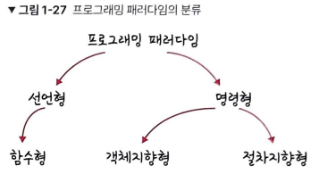

- 면접을 위한 CS전공지식 노트(스터디) 2022.10.16 -

## 📌 프로그래밍 패러다임

 개발자에게 프로그래밍의 관점을 갖게 해주는 역할을 하는 개발 방법론. 어떠한 패러다임이 가장 좋다 라는 것은 없고, 비지니스 로직이나 서비스의 특징을 고려해 패러다임을 정할 것. 하나의 패러다임을 기반으로 통일하여 서비스를 구축하는 것도 좋지만 여러 패러다임을 조합하여 상황과 맥락에 따라 패러다임 간의 장점만 취해 개발하는 것도 좋음.

### 🌞 선언형(함수형) 프로그래밍

무엇을(What) 풀어내는가에 집중하는 패러다임. “프로그램은 함수로 이루어진 것이다” 라는 명제가 담긴 패러다임. 

- **순수 함수**(출력이 입력에만 의존하는 함수)들을 블록처럼 쌓아 로직을 구현하고 **고차 함수**를 통해 재사용성을 높인 프로그래밍 패러다임.
    - **고차 함수** 함수가 함수를 값처럼 매개변수로 받아 로직을 생성할 수 있음. → 고차함수를 쓰기 위해 해당 언어가 **일급 객체**라는 특징을 가져야함.
        - **일급 객체**
            - 변수나 메서드에 함수를 할당할 수 있다.
            - 함수 안에 함수를 매개변수로 담을 수 있다.
            - 함수가 함수를 반환할 수 있다.

### 🌞 객체지향 프로그래밍

객체들의 집합으로 프로그램의 상호작용을 표현하며 데이터를 객체로 취급하여 객체 내부에 선언된 메서드를 활용하는 방식. **설계에 많은 시간이 소요되고, 처리 속도가 다른 프로그래밍 패러다임에 비해 상대적으로 느림.**

- 추상화 - 복잡한 시스템으로부터 핵심적인 개념 또는 기능을 간추려 내는 것.
- 캡슐화 - 객체의 속성과 메소드를 하나로 묶고 일부를 외부에 감추어 은닉하는 것.
- 상속성 - 상위 클래스의 특성을 하위 클래스가 이어받아 재사용하거나 추가, 확장하는 것을 말함. 코드의 재사용 측면, 계층적인 관계 생성, 유지 보수성 측면에서 중요.
- 다형성 - 하나의 메소드나 클래스가 다양한 방법으로 동작하는 것을 말함.
    - **오버로딩** - 같은 이름의 메소드가 여러개. 메소드의 타입, 매개변수 유형, 개수 등으로 여러개를 둘 수 있으며 컴파일 중에 발생하는 **‘정적’ 다형성.**
    - **오버라이딩** - 주로 메소드 오버라이딩을 말하며 상위 클래스로부터 상속받은 메소드를 하위 클래스가 재정의하는 것. 런타임 중 발생하는 **‘동적’ 다형성**./
    

**OOP 설계 원칙 (SOLID)**

- **단일 책임 원칙**(SRP, Single Responsibilty Priciple) - 모든 클래스는 각각 하나의 책임만 가져야하는 원칙.
- **개방-폐쇄 원칙**(OCP, Open Closed Priciple) - 유지 보수 사항이 생겼을 때 코드를 쉽게 확장할 수 있고, 수정에는 닫혀 있어야 하는 원칙. 기존의 코드는 잘 변경하지 않고 확장은 쉽게 할 수 있어야함.
- **리스코프 치환 원칙**(LSP, Liskov Ssubstritutiton Principle) - 프로그램의 객체는 프로그램의 정확성을 깨뜨리지 않으면서 하위 타입의 인스턴스로 바꿀 수 있어야 함. 클래스가 상속될 때, 부모 클래스에 자식 객체를 넣어도 시스템이 문제 없이 돌아가게 만드는 것.
- **인터페이스 분리 원칙**(ISP, Interface Segregation Principle) - 하나의 일반적인 인터페이스보다 구체적인 여러 개의 인터페이스를 만들어야 하는 원칙.
- **의존 역전 원칙**(DIP, Dependency Inversion Principle) - 자신보다 변하기 쉬운 것에 의존하던 것을 추상화 된 인터페이스나 상위 클래스를 두어 벼하기 쉬운 것에 변화에 영향받지 않게 하는 원칙. 즉, 상위 계층은 하우 계층의 변화에 대한 구현으로부터 독립해야 한다.

### 🌞 절차형 프로그래밍

로직이 수행되어야 할 연속적인 계산 과정으로 이루어져 있음. 일이 진행되는 방식으로 코드가 구현되어 있기 때문에 코드의 가독성이 좋고 실행 속도가 빠름. → 계산이 많은 작업 등에 쓰임.(ex. 포트란을 이용한 대기 과학 관련 연산 작업, 머신 러닝의 배치 작업).

**모듈화하기 어렵고 유지 보수성이 떨어짐.**